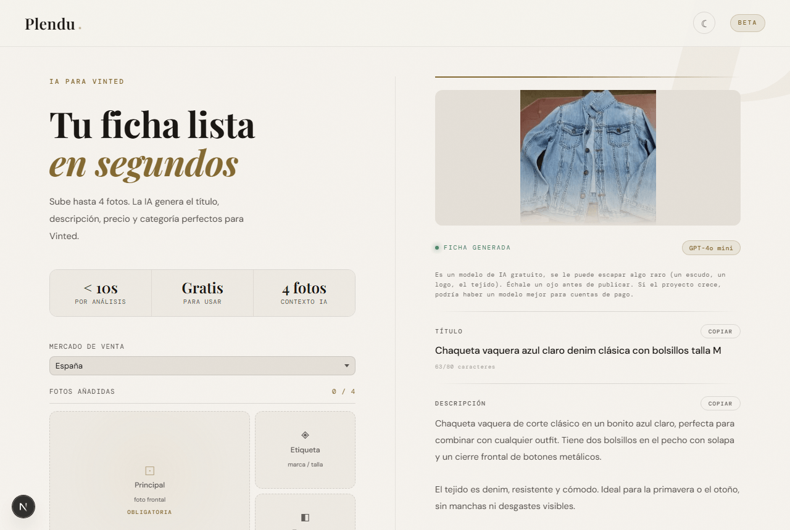
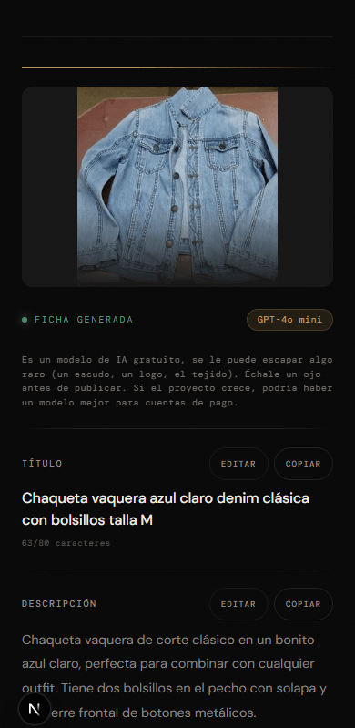

# Plendu

[](https://github.com/M0r3n0SVQ/plendu/actions/workflows/ci.yml)

App para generar fichas de Vinted a partir de fotos. Subes hasta 4 imágenes de una prenda y la IA te devuelve título, descripción, precio, categoría, estado, marca y talla. Gratis, sin registro. Disponible para Vinted España y Francia.

Web: [plendu.app](https://plendu.vercel.app/)

<p align="center">
  
</p>
<p align="center">
  
</p>

## Cómo funciona

Las fotos se redimensionan y comprimen en el navegador antes de enviarse. La API solo las pasa a OpenAI durante el análisis, no las guarda. El historial de las últimas 10 fichas se queda en `localStorage`, con editor de fotos (recortar/rotar) integrado.

Sincronización opcional entre dispositivos: se genera un código de 12 caracteres sin cuenta ni email, se introduce en el otro dispositivo y trae el historial. Se guarda en Redis con TTL de 90 días, borrable a demanda desde la propia app.

Cada ficha se puede compartir por Web Share API o exportar como imagen para stories de Instagram/TikTok (foto + título + precio, compuesta en canvas). También hay unas guías en `/guias` con contenido propio para búsquedas informativas (fotografiar ropa, poner precio, tomar medidas).

Selector de mercado (España / Francia): la interfaz de Plendu se queda en español siempre, pero el título y la descripción de la ficha salen en el idioma del mercado elegido, con las categorías y estados que Vinted usa realmente en ese país. Añadir un mercado nuevo es cuestión de datos (`app/lib/vintedOptions.ts`), no de reescribir código.

Es PWA, así que se puede instalar en el móvil. Tiene tema claro y oscuro, y una pantalla de fallback cuando no hay conexión.

## Stack

- Next.js 16 con App Router (output standalone)
- React 19
- Tailwind 4 + CSS plano
- OpenAI gpt-4o-mini para visión, validado con Zod antes de devolverlo al cliente
- TypeScript en `app/api` y `app/lib` (migración incremental, el resto sigue en JS)
- Upstash Redis para rate limit y sincronización de historial
- Sentry para monitoring
- Vitest para tests, Lighthouse CI en cada pull request
- Service Worker propio

## Desarrollo

Necesitas Node 22 y npm 10.

```bash
git clone https://github.com/M0r3n0SVQ/plendu.git
cd plendu
cp .env.example .env.local
# pon tu OPENAI_API_KEY
npm install
npm run dev
```

Y en [http://localhost:3000](http://localhost:3000).

Scripts: `npm run dev`, `npm run build`, `npm run start`, `npm run lint`, `npm run typecheck`, `npm run test`.

Si prefieres Docker, hay `docker compose up --build`. El Dockerfile es multi-stage con el output standalone de Next.

## Variables de entorno

Solo `OPENAI_API_KEY` es obligatoria. Las demás añaden funcionalidad si están, y se omiten si no:

| Variable | Para qué |
|---|---|
| `OPENAI_API_KEY` | Llamadas a la IA. Sin ella, `/api/analyze` devuelve 503. |
| `UPSTASH_REDIS_REST_URL` + `UPSTASH_REDIS_REST_TOKEN` | Rate limit compartido entre instancias y la sincronización de historial. El rate limit cae a uno en memoria sin esto; la sincronización devuelve 503. |
| `NEXT_PUBLIC_SITE_URL` | Dominio real del despliegue, para `metadataBase`, canonical, sitemap y robots.txt (`app/lib/siteUrl.ts`). Sin esto cae a la URL de Vercel. |
| `NEXT_PUBLIC_SENTRY_DSN` | Captura de errores. Sin esto Sentry no se inicializa. |
| `SENTRY_ORG`, `SENTRY_PROJECT`, `SENTRY_AUTH_TOKEN` | Subir sourcemaps a Sentry en el build. Opcional. |

## Desplegar en Vercel

Importa el repo en [vercel.com/new](https://vercel.com/new), mete las variables de entorno y dale a Deploy. Ya está. El `vercel.json` del repo configura la región (cdg1, París) y sube el timeout de `/api/analyze` a 60 s con 1 GB de memoria.

Si pones dominio propio, añade `NEXT_PUBLIC_SITE_URL=https://tudominio.com` en las variables de entorno de Vercel — `metadataBase`, los canonical, el sitemap y el robots.txt lo recogen solos, sin tocar código.

### Upstash

Si quieres el rate limit serio, crea una BD Redis gratis en [console.upstash.com](https://console.upstash.com) (yo uso `eu-west-1`), copia las dos credenciales REST y pégalas en Vercel. El endpoint hace 10 req/min por IP con sliding window. Si Upstash se cae, deja pasar la petición en vez de bloquear (el límite de OpenAI sigue ahí de tope).

### Sentry

Proyecto Next.js en [sentry.io](https://sentry.io), copias el DSN de Client Keys y lo pones en `NEXT_PUBLIC_SENTRY_DSN`. Solo se mandan los 500. Los 429 y 401 están filtrados porque son señales esperadas y solo harían ruido.

## Estructura

```
app/
  api/                 TypeScript
    analyze/route.ts     POST con las fotos, valida la respuesta de la IA con Zod
    sync/route.ts        GET/POST/DELETE del historial por código de sincronización
    pwa-icon/route.js    Icono PWA dinámico
  components/
    ImageUploader.js     Orquesta subida, drag-reorder, análisis y estado del historial
    FichaPanel.js        Ficha generada: edición, copiar, compartir, imagen story
    EmptyPanel.js         Estado vacío + lista del historial
    SkeletonPanel.js      Shimmer mientras la IA analiza
    Toast.js              Notificaciones con acción (deshacer, reintentar...)
    PhotoEditor.js       Recortar y rotar fotos en canvas
    SyncModal.js         UI de la sincronización por código
    OnboardingModal.js   Modal de la primera visita
    PWAInstall.js        Prompt de "añadir a pantalla de inicio"
    ThemeToggle.js
  lib/                 TypeScript
    historial.ts       Saneado de fichas/historial (compartido cliente + servidor)
    historialStore.ts   Persistencia en localStorage + push a sincronización
    rateLimit.ts       Rate limiting con fallback en memoria
    redis.ts           Cliente de Upstash
    syncClient.ts       Fetch wrappers de /api/sync
    imageUtils.ts       Compresión, miniaturas, canvas de la imagen story
    csvExport.ts         Exportar historial a CSV
    clipboard.ts         Copiar al portapapeles con fallback
    vintedOptions.ts    Categorías/estados/tallas/alertas, por mercado (ES/FR)
    siteUrl.ts            Dominio del despliegue (NEXT_PUBLIC_SITE_URL o fallback a Vercel)
  guias/               Guías de contenido (SEO)
  privacidad/page.js
  layout.js              Metadata, JSON-LD, SW, theme inline
  page.js
  error.js / global-error.js / not-found.js
  icon.js                Favicon
  opengraph-image.js
  sitemap.js
  robots.js
public/
  manifest.json
  sw.js                  Service Worker
```

## Seguridad de `/api/analyze`

- Rate limit por IP (Upstash o memoria como fallback).
- `Content-Length` obligatorio, con tope de 30 MB para 4 imágenes.
- MIMEs solo `jpeg`, `png` y `webp`.
- Validación de la base64 con regex antes de tocar nada.
- Sanitización campo a campo del JSON que devuelve la IA antes de mandarlo al cliente.
- `Cache-Control: no-store`.
- Cabeceras globales en `next.config.mjs`: CSP, HSTS, COOP, CORP, Permissions-Policy, X-Frame-Options.

## Roadmap

Cosas que iré haciendo cuando me apetezca.

Para antes de mover la app más en serio:

- [x] Rate limit con Upstash
- [x] Sentry
- [x] CI con GitHub Actions
- [x] Tests con Vitest (`/api/analyze` y `/api/sync`, 42 tests)
- [x] Vinted Francia además de España (mismo euro y misma talla EU — el mercado más simple para empezar)
- [x] Analítica (Vercel Analytics)
- [x] Lighthouse en cada pull request, con umbrales calibrados
- [x] Sincronización de historial entre dispositivos, sin cuenta ni login (código + Upstash)
- [x] Contenido propio para búsquedas informativas (`/guias`)
- [x] Compartir ficha como imagen para stories de Instagram/TikTok
- [ ] Logo/favicon de verdad, no el dinámico actual

Si crece y tiene sentido monetizar:

- [ ] Cuota: gratis hasta X fichas/día, ilimitado con suscripción
- [ ] Stripe con un plan "Pro" barato
- [ ] Probar Claude Sonnet o gpt-4o para descripciones más finas
- [ ] Detección de defectos como segundo pase
- [ ] Más mercados de Vinted (IT, DE, UK, PT — el Reino Unido necesita además conversión de libras y de tallas)
- [ ] Precio sugerido con datos reales de artículos vendidos — descartado por ahora: sin fuente de datos accesible (ver más abajo)

Si llega a ser un producto serio:

- [ ] Integración con Vinted (API si la abren, o extensión que rellene el formulario)
- [ ] Multi-prenda en una sola subida
- [ ] App nativa para iOS/Android

Mantenimiento:

- [x] Migrar a TypeScript poco a poco, empezando por `app/api` (hecho: `app/api` y `app/lib`; el resto sigue en JS)
- [x] Validar la respuesta de la IA con Zod
- [x] Partir `ImageUploader.js` en archivos separados (1695 → 752 líneas; 4 componentes y 3 módulos de `lib/` nuevos)
- [ ] Sacar el panel derecho del portal y meterlo en estado React
- [ ] Seguir la migración a TypeScript por los componentes (`.tsx`)

## Privacidad

Las fotos no se guardan en ningún servidor mío. Llegan a la API, se mandan a OpenAI una vez y se descartan. El historial y la preferencia de tema viven en tu navegador; solo si activas la sincronización entre dispositivos viaja por HTTPS y se guarda una copia en Redis, bajo un código que nadie más tiene, y se puede borrar cuando quieras.

Más en `/privacidad`.

## Licencia

[PolyForm Noncommercial 1.0.0](LICENSE) — puedes leer, clonar y usar el código para cualquier fin no comercial (aprender, probar, un proyecto propio sin ánimo de lucro...), pero no para montar un servicio de pago con él. Si quieres usarlo comercialmente, escríbeme. Si te interesa contribuir, abre un issue.
